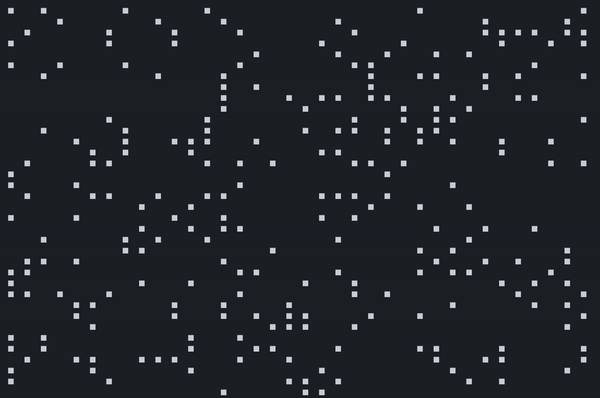
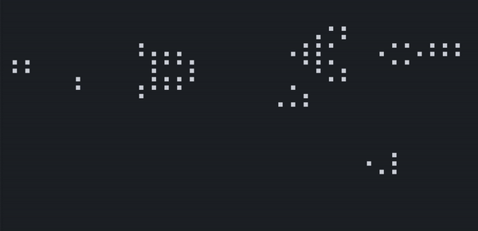

# Calcul parallèle et programmation concurrente

MSO 3.3 : Internet des objets et systèmes concurrents embarqués.

Introduction à la programmation parallèle en c++.

## Approximation de pi par le cercle unitaire

```
 g++ pi_cercle_unite.cpp -o pi -lpthread -std=c++17
 ./pi
```

Pour un cercle unitaire, l'aire vaut `A = pi * r^2 = pi`. On peut donc par une méthode de Monte Carlo, effectuer un grand nombre d'impacts aléatoires dans un carré `[0,1] x [0,1]` dans lequel est inscrit le quart supérieur droit du cercle. Pour savoir si un point est dans le quart de cercle, on regarde si `x^2 + y^2 <= 1`. 

Soit `N` le nombre d'impacts et `N_hits` le nombre d'impacts dans le cercle, alors `N_hits/N = pi*r^2/4/r^2 = pi/4`.

Donc `pi = 4*N_hits/N`.

## Tri

## Billes

```
g++ billes.cpp -o billes -lpthread -std=c++17
./billes
```

Chaque thread `i` représente un travailleur ayant besoin de `n_i` billes pour effectuer sa tâche. Il n'y a que `N` billes en tout et la somme des `n_i` est inférieure à `N`. Chaque travailleur doit donc, indépendemment des autres, demander si assez de billes sont disponibles. Si oui, ces billes lui sont attriubuées pour une certaine durée, et sont donc retirées de la réserve commune. Le travailleur rend ensuite les billes une fois sa tâche terminée.

Un thread contrôleur vérifie à intervalles de temps réguliers que le nombre de billes de la réserve commune est bien compris entre 0 et `N` (cependant, comme l'accès à cette variable globale est protégé, cela n'est pas censé arriver).

## Game of life

```
g++ gameoflife.cpp -o gol -lpthread -std=c++17
./gol
```

Implémentation du jeu de la vie en multithread. Chaque thread s'occupe d'une portion de la grille et compte le nombre de voisins de chaque cellule. Le thread principal se charge ensuite d'actualiser la grille.

Vous avez le choix entre une initialisation random de la grille (choix `y/n`) :



ou une initialisation produisant un *Gosper glider gun* :

